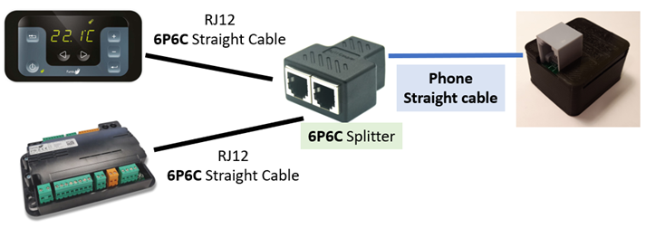

## Splitter Cabling

If your stove has no visible RJ12 connector, you'll neded to add a cable and a splitter between the controller and the control panel like this:  

The splitter should correspond to this small schematic :  

I'm offering these as an option on my store if needed  